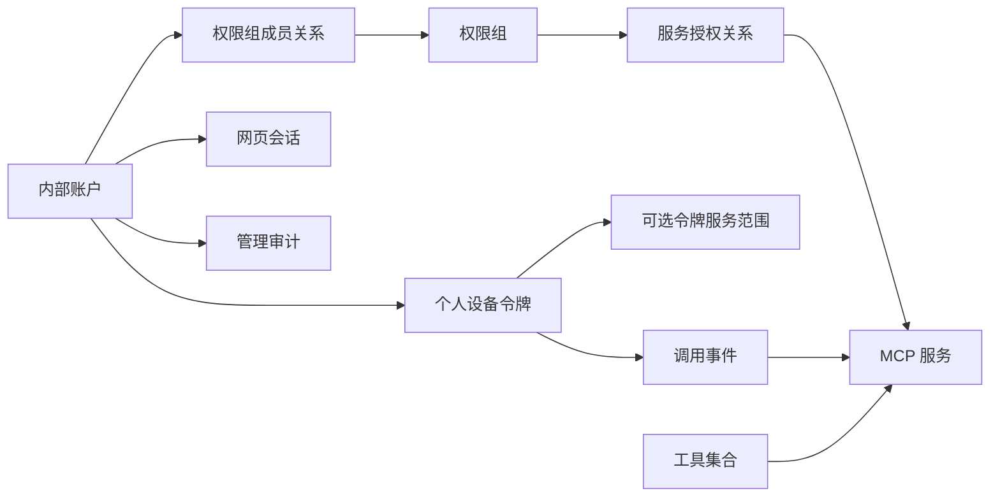

# 内部团队 MCP Hub 产品设计

## 1. 文档目的

本文定义 MCPJungle 面向内部团队的目标产品形态，作为后续数据模型、API、管理端和测试实现的统一依据。

系统尚未投入使用，因此本次重构不保留旧认证和授权模型的兼容能力。实现时可以删除旧字段、旧接口和旧页面，并重新初始化数据库。

## 2. 产品定位

产品定位为：

> 面向内部团队的 MCP 服务目录、访问控制网关和调用观测平台。

产品解决以下问题：

1. 统一接入、校验、发布和管理内部 MCP 服务。
2. 通过权限组为内部人员批量分配 MCP 服务访问权。
3. 允许成员自助创建个人名下的设备令牌。
4. 将每次 MCP 工具调用归属到具体人员和设备。
5. 为管理员、服务负责人和成员提供相应范围的调用观测。

首版不建设公开市场、多租户、工作流编排、计费系统或动态策略引擎。

## 3. 设计原则

- **人员是授权主体：** 权限、设备令牌和调用记录最终归属到真实内部人员。
- **默认拒绝：** 用户没有加入权限组时，不具备任何 MCP 服务访问权。
- **令牌只做收窄：** 设备令牌不能获得超出用户权限组的服务权限。
- **管理权与使用权分离：** 能管理服务不代表能调用该服务。
- **服务先校验后发布：** 连接成功不等于立即对团队开放。
- **敏感内容最小留存：** 不保存 MCP 参数、返回内容、令牌明文和服务密钥明文。
- **停用立即生效：** 人员、令牌、服务或授权被停用后，后续请求立即被拒绝。
- **历史可追溯：** 人员和服务采用停用或归档，不通过硬删除破坏调用与审计归属。

## 4. 角色与职责

| 角色 | 职责 |
| --- | --- |
| 系统管理员 | 管理人员、权限组、全部 MCP 服务、审计日志和系统配置 |
| 服务管理员 | 管理被指派的 MCP 服务，包括配置、校验、发布、停用和健康状态 |
| 普通成员 | 查看本人可用的服务，管理个人设备令牌，查看个人调用量 |
| 审计查看者 | 查看全局调用分析、安全事件和管理审计，不修改配置 |

系统角色只决定管理端操作能力。实际 MCP 调用权限统一由权限组计算。系统管理员如果需要调用某项 MCP 服务，也必须加入获授权的权限组。

## 5. 核心领域模型

### 5.1 模型关系



### 5.2 数据实体

#### User

- 不可变 ID。
- 用户名和显示名称。
- 密码哈希。
- 系统角色。
- 状态：`pending_activation`、`active`、`disabled`。
- 是否需要首次修改密码。
- 最后登录时间。
- 创建人、创建时间和更新时间。

不再保留 `AccessToken` 和 `AllowedServers` 字段。

#### UserSession

- 所属用户。
- 随机会话标识的哈希。
- 创建时间、过期时间和最后活动时间。
- 来源 IP 和 User-Agent 摘要。
- 撤销时间。

网页使用 HttpOnly、Secure、SameSite Cookie 保存会话标识。默认会话有效期为 8 小时。服务端每次请求校验会话和用户状态，支持立即撤销。

#### PermissionGroup

- 不可变 ID。
- 唯一名称、显示名称和说明。
- 状态：`active`、`disabled`。
- 创建人、创建时间和更新时间。

#### PermissionGroupMember

- 权限组 ID。
- 用户 ID。
- 分配人和分配时间。
- `(permission_group_id, user_id)` 唯一约束。

#### PermissionGroupService

- 权限组 ID。
- MCP 服务 ID。
- 分配人和分配时间。
- `(permission_group_id, mcp_service_id)` 唯一约束。

#### DeviceToken

- 不可变 ID。
- 所属用户 ID。
- 用户可读名称，例如「Cursor-办公电脑」。
- Token 前缀和 Token 哈希。
- 范围模式：`inherit_all` 或 `restricted`。
- 状态：`active`、`revoked`、`expired`。
- 过期时间、最后使用时间、最近 IP 和客户端标识。
- 创建时间和撤销时间。

数据库只保存 Token 前缀和单向哈希。明文只在创建成功时返回一次。Token 格式使用可识别前缀，例如 `mcpdt_<id>_<secret>`，便于快速定位记录后进行恒定时间哈希比较。

#### DeviceTokenService

- 设备令牌 ID。
- MCP 服务 ID。
- 仅在令牌范围模式为 `restricted` 时使用。
- `(device_token_id, mcp_service_id)` 唯一约束。

#### McpService

- 不可变 ID。
- 唯一 `slug`、显示名称、说明和使用指南。
- 传输类型：Streamable HTTP、SSE、STDIO。
- 连接配置和认证配置。
- 生命周期状态。
- 初始化超时、调用超时、最大并发数和会话模式。
- 最近校验时间、最近成功时间、连续失败次数和最后错误摘要。
- 创建人、修改人、创建时间、更新时间和归档时间。

权限关系绑定不可变 ID，不绑定可修改名称。

#### McpServiceManager

- MCP 服务 ID。
- 用户 ID。
- 负责人类型：`primary` 或 `backup`。

#### ToolCollection

现有 Tool Group 更名为工具集合（Tool Collection）。它只用于组合多个 MCP 服务中的工具并提供独立端点，不参与人员授权。

#### CallEvent

- 请求 ID。
- 调用时间。
- 用户 ID、设备令牌 ID、MCP 服务 ID。
- 工具名称。
- 结果：`success`、`upstream_error`、`timeout`、`permission_denied`、`service_disabled`。
- 总耗时、上游耗时、请求字节数和响应字节数。
- 标准化错误码。
- 来源 IP 和客户端标识。

默认不保存 MCP 调用参数、返回内容和请求头。

#### CallDailyAggregate

- 日期。
- 用户 ID、设备令牌 ID、MCP 服务 ID、工具名称和结果类型。
- 调用次数、总耗时、最大耗时和总字节数。
- 使用复合唯一索引支持幂等聚合。

#### AuditEvent

- 操作者用户 ID。
- 操作类型。
- 目标对象类型和 ID。
- 操作时间、来源 IP、结果。
- 脱敏后的变更摘要。

审计事件只允许追加，不提供修改和删除接口。

## 6. 账户与人员生命周期

### 6.1 创建与激活

首版采用本地账户：

1. 系统管理员创建账户并设置一次性初始密码。
2. 初始密码只显示一次。
3. 用户首次登录后必须修改密码。
4. 修改成功后账户从 `pending_activation` 进入 `active`。

首版不发送邮件，也不依赖外部身份提供方。未来接入 OIDC 或 LDAP 时仍使用当前内部用户 ID，不改变权限和审计关系。

### 6.2 停用与恢复

停用账户后，系统立即：

- 拒绝新的网页登录。
- 撤销现有网页会话。
- 撤销名下全部设备令牌。
- 将用户排除在权限计算之外。
- 保留权限组关系、调用记录和审计记录。

恢复账户不会自动恢复已撤销的设备令牌，用户需要重新创建令牌。

### 6.3 密码安全

- 密码使用 bcrypt 哈希，不保存明文。
- 初始密码和重置密码均要求首次登录修改。
- 登录接口执行 IP 与用户名双维度频率限制。
- 连续失败达到阈值后短时冻结登录，不冻结 MCP 设备令牌。
- 密码修改和管理员重置密码后撤销所有网页会话。

## 7. 授权模型

### 7.1 用户权限

用户的服务权限是所有有效权限组授权服务的并集：

```text
user_services = UNION(active_group.services)
```

没有有效权限组或所属组均未授权服务时，结果为空。

### 7.2 设备令牌权限

```text
if token.scope_mode == inherit_all:
    effective_services = user_services
else:
    effective_services = user_services INTERSECT token.services
```

设备令牌服务范围中的越权服务不会生效。创建或修改令牌时，API 同样拒绝超出当前用户权限的服务 ID。

### 7.3 工具集合权限

工具集合不能授予服务权限。用户通过集合端点访问时，Hub 只暴露其有效服务范围内且处于启用状态的工具。

### 7.4 生效时机

首版在每次 MCP 请求时从数据库读取用户、令牌和授权关系，不增加跨请求权限缓存。这样可以保证停用、撤销和调组立即生效。后续引入缓存时必须提供可靠的主动失效机制。

## 8. 设备令牌管理

- 普通成员可以创建、重命名和撤销自己的令牌。
- 系统管理员可以查看所有令牌元信息并强制撤销。
- 管理员不能查看令牌明文。
- 默认有效期为 90 天。
- 每名用户默认最多拥有 10 个有效令牌。
- 创建时必须选择「继承全部权限」或「限定服务范围」，不使用空数组表达特殊语义。
- 所有 MCP 请求只能使用设备令牌，网页会话不能调用 MCP。
- 撤销、过期、账户停用或权限移除后，请求立即失败。

## 9. MCP 服务生命周期

### 9.1 状态

| 状态 | 含义 |
| --- | --- |
| `draft` | 草稿，尚未执行连接校验 |
| `validating` | 正在执行异步连接和能力校验 |
| `validation_failed` | 校验失败，可修改后重试 |
| `pending_publish` | 校验成功，等待发布 |
| `online` | 已上线，可被授权和调用 |
| `unhealthy` | 已上线但健康检查连续失败 |
| `disabled` | 管理员主动停用，禁止调用 |
| `archived` | 已归档，仅保留历史关系和统计 |

### 9.2 接入流程

1. 服务管理员创建草稿。
2. 填写连接方式、认证配置、负责人和运行参数。
3. 发起异步连接校验。
4. Hub 完成 MCP 初始化及工具、提示词和资源发现。
5. 页面展示能力快照和相较上次的变化。
6. 管理员确认并发布。
7. 发布后才能授权给权限组并对成员可见。

### 9.3 变更规则

- 修改连接地址、认证配置、启动命令或传输类型后，服务回到 `draft`，需要重新校验和发布。
- 修改说明、负责人和使用指南不影响在线状态。
- 工具列表变化时记录新增、删除和 Schema 变化。
- 紧急停用立即阻断新调用。
- 健康恢复只恢复为 `pending_publish`，不自动重新上线。
- 归档替代硬删除，历史调用和审计继续关联原服务。

### 9.4 健康检查

在线服务定时执行轻量检查，记录：

- MCP 初始化结果。
- 响应耗时。
- 最近成功时间。
- 连续失败次数。
- 最后错误摘要。

默认连续失败 3 次进入 `unhealthy`。异常状态不伪装成权限错误，调用方收到明确的上游不可用错误。

### 9.5 密钥管理

- 服务密钥使用由环境变量 `MCPHUB_MASTER_KEY` 提供的主密钥加密后存储。
- API 只返回是否已配置和脱敏摘要。
- 修改密钥采用覆盖写入，不能读取原值。
- 主密钥未配置时，企业模式拒绝启动。
- 审计日志记录密钥配置被修改，但不记录原值、新值或可逆摘要。

## 10. 调用记录与统计

### 10.1 记录时机

系统在完成身份识别后为每次工具调用记录事件：

- 权限拒绝、服务停用和上游失败均有明确结果类型。
- 未认证请求进入安全事件日志，不进入正常调用量。
- `success` 才计入成功调用量。
- 调用事件写入失败不得改变 MCP 调用结果，但必须产生内部错误指标和日志。

调用事件在响应返回前完成持久化。首版优先保证统计完整性，不引入消息队列。

### 10.2 展示指标

- 今天、近 7 天和近 30 天调用量。
- 成功次数、失败次数和成功率。
- 活跃用户和活跃设备数。
- 用户、服务和工具维度的调用量。
- 服务和工具维度的失败率与 P95 耗时。
- 权限拒绝、服务停用和超时趋势。
- 长期未使用的服务、人员和设备令牌。

普通成员只看本人；服务管理员只看负责服务；系统管理员和审计查看者看全局。

### 10.3 保留与导出

- 调用明细默认保留 90 天。
- 日聚合默认保留 1 年。
- 保留期可以由系统管理员调整。
- CSV 导出执行标准转义，并对 `=、+、-、@` 开头的单元格做公式注入防护。

## 11. 审计范围

以下操作必须写入 `AuditEvent`：

- 人员创建、激活、停用、恢复和密码重置。
- 权限组创建、停用、成员变更和服务授权变更。
- 设备令牌创建、撤销和管理员强制撤销。
- MCP 服务创建、校验、发布、停用、归档和配置修改。
- 服务负责人调整。
- 系统配置修改。
- 调用数据和审计数据导出。

## 12. 管理端信息架构

### 12.1 系统管理员

- 工作台
- MCP 服务
- 权限组
- 人员
- 工具集合
- 调用分析
- 审计日志
- 系统设置

### 12.2 普通成员

- 我的服务
- 我的设备令牌
- 我的调用量
- 使用指南

### 12.3 服务管理员

普通成员页面之外，增加「我负责的服务」。

### 12.4 审计查看者

- 调用分析
- 审计日志

前端路由和操作按钮根据角色直接隐藏。后端仍执行完整权限校验，不能把前端隐藏作为安全边界。

## 13. 关键页面逻辑

### 我的服务

- 只展示当前用户有权访问且已上线的服务。
- 展示服务说明、负责人、健康状态和工具清单。
- 根据用户选择的设备令牌生成 Cursor、Claude Desktop 等客户端配置片段。

### 权限组

- 在同一详情页维护组成员和已授权服务。
- 展示受影响人数和服务数。
- 保存前预览权限变化。
- 停用权限组前提示将失去权限的用户和服务。

### 人员详情

- 展示系统角色、账户状态和所属权限组。
- 展示最终可访问服务，不要求管理员手工推导。
- 展示设备令牌元信息和近期调用量。
- 停用人员前明确提示会撤销全部会话和设备令牌。

### MCP 服务详情

- 展示生命周期状态、健康检查、能力快照和负责人。
- 展示授权该服务的权限组和实际使用人员。
- 展示调用量、成功率、P95 耗时和错误趋势。
- 连接配置和密钥与普通信息分区显示。

### 设备令牌

- 展示名称、前缀、范围、有效期、状态和最后使用时间。
- 明文只在创建完成弹窗展示一次。
- 撤销操作不可恢复。

## 14. API 边界

管理 API 统一使用 `/api/v1`：

- `/api/v1/auth/*`：登录、退出、当前用户和修改密码。
- `/api/v1/users/*`：人员管理和状态变更。
- `/api/v1/permission-groups/*`：权限组、成员和服务授权。
- `/api/v1/device-tokens/*`：个人设备令牌管理。
- `/api/v1/mcp-services/*`：服务草稿、校验、发布和健康状态。
- `/api/v1/tool-collections/*`：工具集合管理。
- `/api/v1/analytics/*`：个人、服务和全局调用统计。
- `/api/v1/audit-events/*`：审计查询和导出。

MCP 入口保留：

- `/mcp`：全局服务入口。
- `/v1/collections/:slug/mcp`：工具集合入口。

旧 `/api/v0` 用户、客户端和 Dashboard 接口不保留兼容。

## 15. 错误处理

对外错误码至少区分：

- `UNAUTHENTICATED`：缺少或无效凭据。
- `ACCOUNT_DISABLED`：账户已停用。
- `TOKEN_REVOKED`：设备令牌已撤销。
- `TOKEN_EXPIRED`：设备令牌已过期。
- `PERMISSION_DENIED`：已识别人员但无服务权限。
- `SERVICE_NOT_ONLINE`：服务未发布或已停用。
- `UPSTREAM_UNAVAILABLE`：上游 MCP 服务不可用。
- `UPSTREAM_TIMEOUT`：上游调用超时。
- `TOOL_NOT_FOUND`：工具不存在或已下线。

API 返回稳定错误码和面向用户的简短信息，详细堆栈只进入服务端日志。

## 16. 首版范围

### 必须完成

- 本地内部账户、首次改密、停用和恢复。
- 系统管理员、服务管理员、普通成员和审计查看者。
- 权限组及用户、服务多对多授权。
- 个人设备令牌自助管理。
- MCP 服务草稿、异步校验、发布、停用和归档。
- 服务健康检查和能力发现。
- 基于个人身份的调用明细与统计。
- 管理操作审计。
- 按角色区分的管理端。
- Tool Group 更名为 Tool Collection。

### 暂不实现

- OIDC、LDAP、企业微信等统一身份认证。
- 多租户和外部客户。
- 审批流。
- 计费、套餐和配额。
- 单工具级授权。
- 调用参数和返回内容留存。
- 复杂告警通知和自动化策略。
- 基于部门属性的动态授权策略。

## 17. 非兼容重构约束

系统尚未投入使用，因此实现采用干净模型：

- 删除用户长期 `AccessToken`。
- 删除用户 `AllowedServers`。
- 用 `DeviceToken` 替代 `McpClient` 的身份凭据职责。
- 用 `PermissionGroup` 表达人员与服务授权。
- 将 `ToolGroup` 重命名为 `ToolCollection`。
- 不实现旧 Token、旧数据库或旧 API 的迁移和回退路径。
- 开发和部署环境重新初始化数据库。

## 18. 验收标准

1. 任意成功或失败的 MCP 工具调用都能定位到具体人员、设备令牌、服务和工具。
2. 停用人员、撤销令牌或移除授权后，下一次请求立即被拒绝。
3. 设备令牌不能获得权限组之外的服务权限。
4. 没有权限组的用户默认不能调用任何服务。
5. 未发布、异常待确认、已停用或已归档服务不能被调用。
6. 普通成员不能访问人员、权限组、审计和全局统计。
7. 服务管理员只能修改自己负责的服务。
8. 权限、人员、服务、令牌和导出操作均有不可修改的审计记录。
9. 服务故障、认证失败和权限拒绝使用不同错误码和统计口径。
10. 数据库不保存设备令牌明文、网页会话明文、服务密钥明文或 MCP 调用内容。
11. 普通成员可以从「我的服务」生成可直接使用的客户端配置。
12. 调用分析可以按人员、设备、服务、工具、结果和时间范围筛选。

## 19. 测试要求

- 单元测试覆盖权限并集、令牌权限交集、账户状态和服务状态判断。
- API 测试覆盖所有角色的允许与拒绝路径。
- MCP 端到端测试使用真实 Streamable HTTP 客户端完成初始化、工具发现和工具调用。
- 安全测试覆盖明文泄漏、撤权即时生效、越权令牌范围和审计脱敏。
- 生命周期测试覆盖服务校验、发布、异常、停用、恢复待确认和归档。
- 调用统计测试覆盖成功、失败、超时、拒绝及人员归属。
- 前端构建、类型检查和关键页面交互必须通过。

## 20. 实施顺序

1. 重建账户、会话、权限组和设备令牌模型。
2. 重写网页认证和 MCP 设备令牌鉴权。
3. 完成权限组管理与最终权限计算。
4. 重建 MCP 服务生命周期和服务负责人模型。
5. 重写管理端角色导航与核心页面。
6. 建立调用事件、日聚合和审计日志。
7. 完成工具集合重命名和权限过滤。
8. 更新 Compose、环境变量、文档和完整测试。
